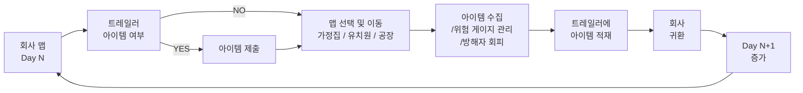
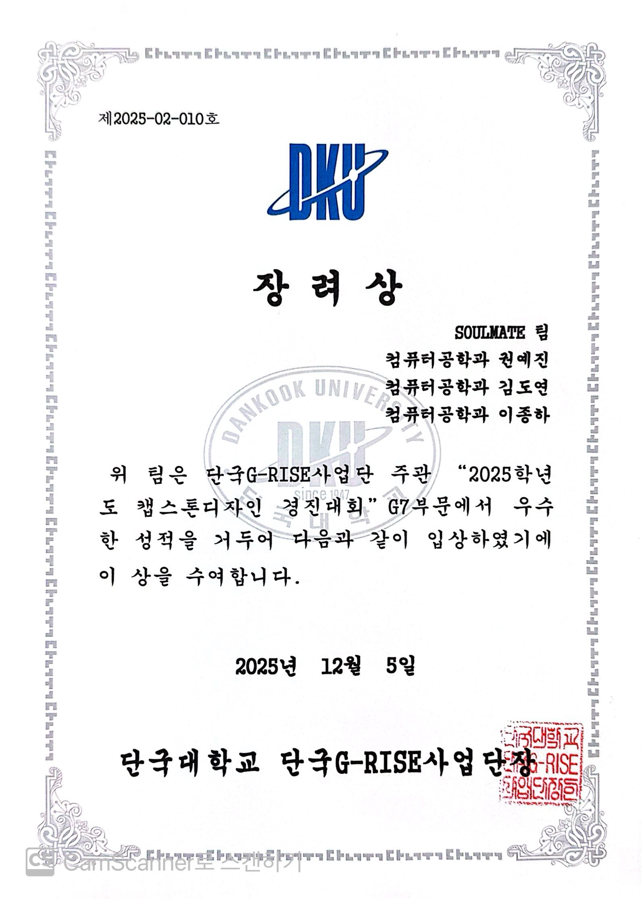

# DelRev 🎮

<div align="center">

**다양한 배경과 AI 몬스터들로부터 도망치며 생존하는 풀-3D 스텔스 서바이벌 게임**

[](https://unity.com)
[](https://docs.microsoft.com/en-us/dotnet/csharp/)
[](LICENSE)
[]()

</div>


## 📚 목차
|순번|항목|
|:---:|:-------------------:|
| 1️ | 📌 [프로젝트 개요](#1) |
| 2 | 👥 [개발 팀](#2) |
| 3 | ✨ [주요 기능](#3) |
| 4 | 🛠️ [기술 스택](#4) |
| 5 | 🎮 [게임 시연](#5) |
| 6 | 📁 [프로젝트 구조](#6) |
| 7 | 🕹️ [설치 및 실행](#7) |
| 8 | 🏆 [수상 내역](#8) |
| 9 | 📜 [개선사항 및 라이센스](#9) |

---

<a id="1"></a>
## 1️⃣ 📌 프로젝트 개요

**DelRev**는 플레이어가 다양한 환경(회사, 공장, 유치원, 가족 주택 등)에서 고유한 AI를 가진 몬스터들로부터 도망치며 생존해야 하는 풀-3D 스텔스 서바이벌 게임입니다.

플레이어는 **체력/스테미나**뿐 아니라, 게임의 핵심 자원인 **위험게이지**를 관리하며 은신과 이동 전략을 세워야 합니다.  
각 스테이지는 독특한 배경과 특화된 AI 몬스터들을 특징으로 하며, **위험게이지를 낮게 유지하기 위한 스텔스 전술**, 아이템 수집, 상황 판단이 생존의 핵심입니다.

- **개발 기간:** 2025.03-2025.11
- **개발 엔진:** Unity 2022.3.47f1  
- **개발 언어:** C#
- **플랫폼**: PC (Windows/macOS)

<details>
  <summary> 📊 상세 통계 </summary>
  
  - **총 C# 스크립트**: 200+ 파일
  - **게임 씬**: 8개
  - **구현된 몬스터 AI**: 10+ 유형
  - **아이템 종류**: 회복, 속도부스트, 코인 등
  - **코드 라인**: 10,000+ 라인

</details>

---

<a id="2"></a>
## 2️⃣ 👥 개발 팀

| 이름 | 권예진 | 김도연 | 김도현 | 이종하 |
|:---:|:---:|:---:|:---:|:---:|
|역할| Client Dev<br/> UI/UX Design | Graphic Design | Client Dev | Client Dev <br/> Sound Design |
| Github | <a href="https://github.com/yejin1029"></a> | <a href="https://github.com/doyeon112"></a> | <a href="https://github.com/hitori839"></a> | <a href="https://github.com/bell-ha"></a> |

---

<a id="3"></a>
## 3️⃣ ✨ 주요 기능

### 🎮 게임플레이 시스템 


- **멀티 스테이지 구성**: 5개의 고유한 배경(회사, 공장, 유치원, 가족 주택, 기타) 기반 진행
  
- **스텔스 메커닉**: 조명/음성/거리 감지에 의해 몬스터가 플레이어를 탐지하는 은신 플레이
- **생존 시스템**  
  - 체력 관리(피해/회복)
  - 코인 수집 및 자원 운영
  - 회복/버프 아이템 사용(상황 대응)

- **핵심 자원 관리(게임 핵심 요소)**
  - **체력/스테미나**: 달리기·숨기기 등 행동에 따라 소모/회복되는 생존 자원
    
  - **인벤토리 제한**: 아이템 **최대 4개 소지**로 선택과 집중 유도
  - **위험게이지**: 플레이어의 ‘노출/리스크’를 나타내는 핵심 자원  
    - 특정 조건에서 **위험게이지가 증가/감소**하며, 임계치 도달 시 **치명적 페널티(게임오버급 이벤트)** 발생
      ```mermaid
        flowchart LR
          A["플레이어 위치 체크"] --> B{"업무장소 내부"}
          B -->|YES| C["위험게이지 감소"]
          B -->|NO| D["위험게이지 증가"]
          D --> E{"위험게이지 = 100"}
          E -->|YES| F["최종 방해자에 의한 즉사"]
          E -->|NO| G["일반 상태"]
        ```

  - **요구일**: 코인 요구 조건을 검사하는 **마감 일자(데드라인)**
    - **일차**(Day)를 기준으로 특정 시점마다 **요구 코인량**이 미달 시 게임 오버 발생
      ```mermaid
        flowchart LR
          A["회사 복귀"] --> B["Day + 1"]
          B --> C{"Day < checkDays"}
          C -->|YES| D["정상 진행"]
          C -->|NO| E["요구 코인량 확인"]
          E --> F{"보유 코인 ≥ 요구 코인"}
          F -->|YES| G["정상 진행"]
          F -->|NO| H["게임 오버"]
        ```

### 🤖 AI 몬스터 시스템
- **스테이지별 고유 몬스터**: 각 스테이지에 맞춘 개성 있는 몬스터와 패턴 설계
- **다양한 행동 유형**: 패트롤/추적/공격/특수 행동 등 상황 기반 행동 변화
- **탐지 메커닉**: 시야각·거리·상황 요소를 활용한 플레이어 인식 로직

<details>
  <summary><b> 가정집 맵 몬스터 </b></summary>

  
</details>

<details>
  <summary><b> 유치원 맵 몬스터 </b></summary>

  
</details>

<details>
  <summary><b> 공장 맵 몬스터 </b></summary>

  
  
</details>

### 💾 게임 진행 및 상태 관리 
- **세이브/로드 시스템**: 게임 진행 상황 저장 및 불러오기
- **글로벌 상태 관**: 씬 전환에서도 게임 상태가 유지되는 진행 구조
- **로딩 씬**: 자연스러운 씬 전환 및 플레이 흐름 개선

### 🎨 비주얼 & 그래픽
- **Universal Render Pipeline (URP)**: 최적화된 그래픽 파이프라인 적용
- **Volume Lighting**: 분위기 연출을 위한 조명/볼륨 효과
- **고품질 3D 모델**: 다양한 에셋 활용을 통한 씬 완성도 강화

### 🔊 오디오 & 연출
- **배경음악/효과음**: 상황별 몰입감 강화
- **장면별 음성 디렉션**: 스테이지 분위기와 서사 전달 보조
- **인트로 영상 재생**: 시작 연출을 위한 Intro 영상 플레이어

---

<a id="4"></a>
## 4️⃣ 🛠️ 기술 스택


### 주요 패키지
| 패키지 | 버전 | 목적 |
|--------|------|------|
| Universal Render Pipeline | 14.0.11 | 그래픽 렌더링 |
| AI Navigation | 1.1.7 | NavMesh 기반 AI |
| TextMesh Pro | 3.0.9 | 고급 텍스트 렌더링 |
| Timeline | 1.7.6 | 시네마틱 연출 |
| Visual Scripting | 1.9.4 | 노드 기반 스크립팅 |

### 개발 도구
- **IDE**: Visual Studio / Rider
- **버전 관리**: Git
- **3D 모델링**: Blender, Maya (외부 에셋 포함)

---

<a id="5"></a>
## 5️⃣ 🎮 게임 시연

### 🎥 데모 영상
🔗 [DelRev_9cut.mov](https://drive.google.com/file/d/1LsHE2zvid1eV_s81filG7HnpXB0DrP9F/view?usp=sharing)

### 🎨 UI/UX


### 🚛 맵 이동 및 진행 시스템


### 🏪 아이템 구매 시스템


### 🔑 문 상호작용 시스템 


### ⚙️ 설정창 시스템 


---

<a id="6"></a>
## 6️⃣ 📁 프로젝트 구조

<details>
  <summary> <b><i>폴더/파일 트리 펼쳐보기</i></b> </summary>
  
```
DelRev/
├── Assets/
│   ├── 0.Scenes/                    # 게임 씬
│   │   ├── Intro.unity              # 인트로 씬
│   │   ├── GameStart.unity          # 스타트 화면
│   │   ├── Company.unity            # 스테이지 1: 회사
│   │   ├── Factory.unity            # 스테이지 2: 공장
│   │   ├── Kindergarten.unity       # 스테이지 3: 유치원
│   │   ├── FamilyHouse.unity        # 스테이지 4: 가족 주택
│   │   ├── GameOver.unity           # 게임 오버 씬
│   │   └── LoadingScene.unity       # 로딩 씬
│   │
│   ├── 1.Script/                    # 게임 로직 스크립트
│   │   ├── StartGame/               # 게임 시작 및 관리
│   │   │   ├── GlobalState.cs       # 전역 상태 관리
│   │   │   ├── StartSceneManager.cs # 시작 씬 관리
│   │   │   └── GameOverUI.cs        # 게임 오버 UI
│   │   │
│   │   ├── 1.Player/                # 플레이어 관련
│   │   │   ├── PlayerController.cs  # 플레이어 조작 (이동, 점프, 스테미나)
│   │   │   ├── PlayerInputBlocker.cs # 입력 제어
│   │   │   └── PlayerAnimation.cs   # 플레이어 애니메이션
│   │   │
│   │   ├── 2.Items/                 # 아이템 시스템
│   │   │   ├── Item.cs              # 기본 아이템
│   │   │   ├── SpeedBoost.cs        # 속도 부스트 아이템
│   │   │   ├── HealingItem.cs       # 회복 아이템
│   │   │   └── CoinUI.cs            # 코인 UI
│   │   │
│   │   ├── 3.Monster/               # AI 몬스터 시스템
│   │   │   ├── Monster.cs           # 기본 몬스터 클래스
│   │   │   ├── IDangerTarget.cs     # 위험 대상 인터페이스
│   │   │   │
│   │   │   ├── Factory/             # 공장 스테이지 몬스터
│   │   │   │   ├── Security_A.cs    # 경비원 A
│   │   │   │   ├── Security_B.cs    # 경비원 B
│   │   │   │   ├── TurretSentinel.cs # 감시탑
│   │   │   │   ├── WeldingRobot.cs  # 용접 로봇
│   │   │   │   ├── DronePatrol.cs   # 드론
│   │   │   │   └── Trap.cs          # 함정
│   │   │   │
│   │   │   ├── kindergarten/        # 유치원 스테이지 몬스터
│   │   │   │   ├── SmartKid/        # 똑똑한 아이 (수학 문제 AI)
│   │   │   │   │   ├── SmartKidAI.cs
│   │   │   │   │   ├── ProblemManager.cs
│   │   │   │   │   ├── MathProblemUI.cs
│   │   │   │   │   └── PlayerInputBlocker.cs
│   │   │   │   ├── Teacher.cs       # 선생님
│   │   │   │   ├── TeacherManager.cs # 선생님 관리
│   │   │   │   ├── Director.cs      # 원장
│   │   │   │   └── DollMonsterAI.cs # 인형 몬스터
│   │   │   │
│   │   │   └── FamilyHouse/
│   │   │       └── Dog.cs           # 개
│   │   │
│   │   ├── 4.loading/               # 로딩 시스템
│   │   │   └── SceneLoadingManager.cs
│   │   │
│   │   ├── Map/                     # 맵 관리
│   │   │   └── MapController.cs
│   │   │
│   │   ├── Navigation/              # 네비게이션
│   │   │   └── NavMeshManager.cs
│   │   │
│   │   ├── Save/                    # 세이브/로드 시스템
│   │   │   ├── SaveManager.cs
│   │   │   ├── SaveLoadUI.cs
│   │   │   └── NewGameInitializer.cs
│   │   │
│   │   ├── UI/                      # UI 시스템
│   │   │   ├── UIManager.cs
│   │   │   ├── PauseMenu.cs
│   │   │   └── HUDController.cs
│   │   │
│   │   ├── Settings/                # 게임 설정
│   │   │   └── GameSettings.cs
│   │   │
│   │   ├── Message/                 # 메시지/알림 시스템
│   │   │   └── MessageSystem.cs
│   │   │
│   │   ├── Bootstrapper.cs          # 게임 초기화
│   │   └── IntroVideoPlayer.cs      # 오프닝 영상 플레이어
│   │
│   ├── 2.Download/                  # 다운로드 콘텐츠
│   ├── 3.Sound/                     # 오디오 에셋
│   ├── 4.Hierarchy_group/           # 계층 정리
│   │
│   ├── Prefabs/                     # 프리팹
│   │   └── Player.prefab            # 플레이어 프리팹
│   │
│   ├── Resources/                   # 런타임 로드 리소스
│   ├── Settings/                    # 게임 설정 에셋
│   │
│   ├── [3D Assets]/                 # 외부 3D 모델 및 이펙트
│   │   ├── Gwangju_3D asset/
│   │   ├── Industrial building/
│   │   ├── Fire/
│   │   ├── VLights/
│   │   ├── ViapixGames/
│   │   ├── StylArts_B/
│   │   └── [기타 에셋들]/
│   │
│   ├── TextMesh Pro/                # TextMesh Pro 에셋
│   ├── UI/                          # UI 에셋
│   └── Fonts/                       # 폰트 에셋
│
├── Packages/
│   ├── manifest.json                # 패키지 의존성
│   └── packages-lock.json
│
├── ProjectSettings/
│   ├── ProjectVersion.txt           # Unity 버전: 2022.3.47f1
│   ├── ProjectSettings.asset        # 프로젝트 설정
│   ├── GraphicsSettings.asset       # 그래픽 설정
│   ├── AudioManager.asset           # 오디오 설정
│   ├── InputManager.asset           # 입력 설정
│   ├── TagManager.asset             # 태그 및 레이어
│   ├── QualitySettings.asset        # 품질 설정
│   └── [기타 설정들]
│
├── Logs/                            # 로그 파일
├── obj/                             # 빌드 중간 파일
├── UserSettings/                    # 사용자 설정
│
└── DelRev.sln                       # Visual Studio 솔루션

```
</details>

---

<a id="7"></a>
## 7️⃣ 🕹️ 설치 및 실행

### 요구사항
- **Unity 2022.3.47f1 LTS** 이상
- **Visual Studio** 또는 **Rider** (C# 개발용)
- **최소 GPU**: NVIDIA GTX 1050 / AMD RX 560 (또는 동급)
- **메모리**: 8GB RAM 이상 권장

### 설치 단계

1. **프로젝트 클론**
   ```bash
   git clone https://github.com/hitori839/DelRev.git
   cd DelRev
   ```

2. **Unity Hub에서 프로젝트 열기**
   - Unity 2022.3.47f1 버전 필수
   - `/DelRev` 폴더를 선택하여 열기

3. **패키지 복구**
   - Unity가 자동으로 `Packages/manifest.json`에서 패키지 다운로드

4. **실행**
   - Play 버튼을 클릭하거나 `Ctrl+P` (또는 `Cmd+P`) 누르기

### 빌드

**윈도우/macOS 스탠드얼론:**
```
File > Build Settings > 플랫폼 선택 > Build
```

**안드로이드 / iOS:**
- 해당 SDK 설치 후 동일하게 빌드

## 🎮 게임플레이 가이드

### 기본 조작
| 키 | 기능 |
|-------|------|
| `WASD` | 이동 |
| `Space` | 점프 |
| `Shift` | 달리기 (스테미나 소모) |
| `Ctrl` | 숨기 (스테미나 소모) |
| `Mouse` | 카메라 회전 |
| `ESC` | 메뉴 |

### 생존 팁
1. **스테미나 관리**: 달리기와 숨기기는 스테미나를 소모합니다
2. **몬스터 회피**: 각 몬스터는 고유한 감지 범위를 가집니다
3. **아이템 수집**: 코인과 회복 아이템으로 생존율 향상
4. **환경 이용**: 조명 어둠과 장애물을 활용한 스텔스

---

<a id="8"></a>
## 8️⃣ 🏆 수상 내역

### 🥉 2025 RIEF-FESTA 캡스톤디자인 경진대회 (G7 부문)
- **수상:** 장려상  
- **주관:** 단국대학교 G-RISE 사업단  
- **선정:** 총 75팀 중 6팀 선정(대상, 우수, 장려)



---

### 🥉 2025 단국대학교 SW중심대학 캡스톤 페스티벌
- **수상:** 장려상  
- **팀명:** Soulmate  
- **주관:** 단국대학교 SW중심대학사업단  
- **선정:** 총 100팀 중 15팀 선정(대상, 최우수, 우수, 장려)


---

<a id="9"></a>
## 9️⃣ 📜 개선사항 및 라이센스

### 현재 개발 중인 기능
- [ ] 추가 난이도 레벨 (Easy, Normal, Hard)
- [ ] 네트워크 멀티플레이 (계획 중)
- [ ] 추가 몬스터 AI 유형
- [ ] 커스텀 키 매핑

### 최적화 계획
- 오브젝트 풀링 적용 예정
- 메모리 최적화 작업 진행 중

이 프로젝트는 **MIT License** 하에 배포됩니다.

```
MIT License

Copyright (c) 2024 hitori839

Permission is hereby granted, free of charge, to any person obtaining a copy
of this software and associated documentation files (the "Software"), to deal
in the Software without restriction, including without limitation the rights
to use, copy, modify, merge, publish, distribute, sublicense, and/or sell
copies of the Software, and to permit persons to whom the Software is
furnished to do so, subject to the following conditions:

The above copyright notice and this permission notice shall be included in all
copies or substantial portions of the Software.

THE SOFTWARE IS PROVIDED "AS IS", BASIS OF ANY KIND, EXPRESS OR IMPLIED,
INCLUDING BUT NOT LIMITED TO THE WARRANTIES OF MERCHANTABILITY, FITNESS FOR
A PARTICULAR PURPOSE AND NONINFRINGEMENT.
```

- **Unity 공식 문서**: https://docs.unity.com
- **URP 문서**: https://docs.unity.com/Manual/universal-render-pipeline
- **NavMesh 튜토리얼**: https://docs.unity.com/Manual/nav-mesh


<div align="center">

**Made with ❤️ using Unity**

</div>
